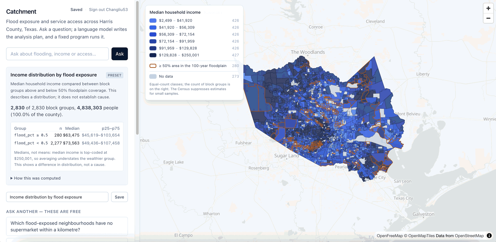
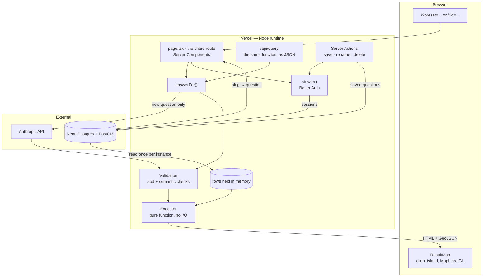
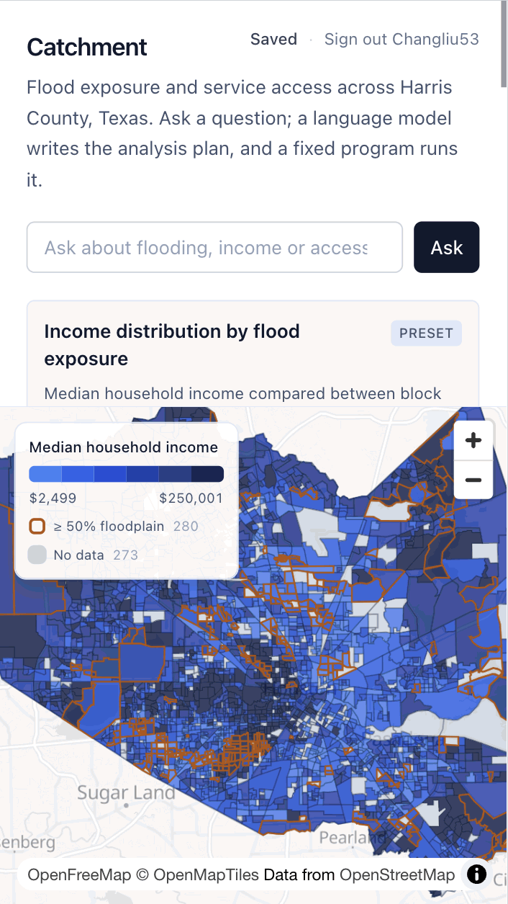
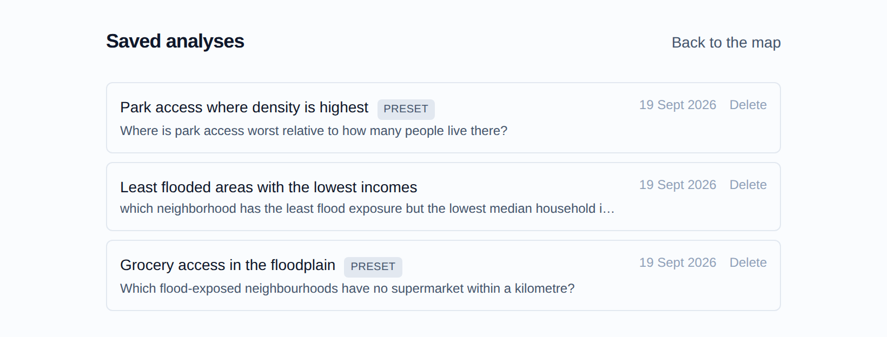

# Catchment

**[Live demo](https://catchment-two.vercel.app)** · [](https://github.com/Changliu53/catchment/actions/workflows/ci.yml)

Ask a question in plain English about Harris County, Texas. The answer is
computed over 2,830 census block groups of flood, income and service-access
data, and drawn as a map.

> Which flood-exposed neighbourhoods have no supermarket within a kilometre?



Google Maps can tell you where a supermarket is. It cannot express _"more than
half of this area sits in the 100-year floodplain **and** its centre is over a
kilometre from the nearest supermarket"_, and it will not tell you how many
people live there. That gap is the whole project.

Next.js 16 App Router, React 19, TypeScript in strict mode, Postgres with
PostGIS, GitHub sign-in for keeping and sharing an analysis, and a test suite —
unit, integration against a real database, and end-to-end against a production
build — that runs before anything deploys.

## The short version

If you read nothing else:

- **The question is in the URL and the answer is in the HTML.** The page is a
  Server Component that runs the analysis and ships the result in the first
  response. Nothing fetches. Apart from the map, it works with JavaScript
  switched off.
- **Authorization is a condition in the query, not a check after it**, and that
  claim is tested against a real Postgres in CI rather than a mock — because a
  mock agrees with whatever the code asks it, including a query missing half
  its conditions.
- **The tests include negative controls.** One spec removes the Web Worker and
  asserts the map renders _nothing_. A regression test that has never failed is
  a guess about what it measures.
- **The UI was measured, not eyeballed.** The map once had a height of exactly
  zero on a 390px screen. That is now asserted at five widths with touch
  emulation.
- **The language model writes a plan; it never touches the data.** Eight field
  names, five operations, a bounded step count. Correctness lives in a pure
  function that is tested without a model.

Things that went wrong, and how each was found, are collected in
[What broke](#what-broke-and-how-it-was-found) rather than sprinkled through.

## Architecture



**The question is in the URL, and the answer is in the HTML.** The page is a
Server Component: it reads `?preset=` or `?q=`, runs the analysis there, and
ships the result in the first response. Nothing fetches. A shared link shows
its answer to anything that can read HTML, and — apart from the map — the app
works with JavaScript switched off, because the question box is an ordinary
GET form and the presets are ordinary links.

Measured on the deployed build: a preset answer arrives as one 64 KB HTML
document containing the headline figures, the statistics table and the audit
trail. The previous version served 22 KB of shell, then ran the bundle, then
POSTed for the data.

The only client component is the map island — WebGL, a Web Worker, and the
hover/selection state that follows a pointer or a tap. Everything else,
including the legend, is HTML. The classification is computed once on the
server and handed to both, so the legend and the colours cannot disagree.

`DATABASE_URL` and `ANTHROPIC_API_KEY` exist only on the server. The browser
receives a rendered page and a GeoJSON payload, and nothing else.

<p align="center">
  
</p>

## Decisions worth a look

**The database is not on the request path.** The dataset is 2,830 rows and
changes only when the pipeline is re-run, so it is fetched once per server
instance and memoised. A request never waits on Postgres — which also means a
cold Neon compute costs a visitor nothing. The memoised promise clears itself
if the fetch rejects, so a transient failure is retried rather than cached
forever.

**One endpoint, three tiers, cheapest first.** A preset question resolves from
a plan that shipped with the build: no model call, no API key, no rate-limit
budget. A repeated question resolves from an LRU cache. Only a genuinely new
question reaches the model, and only after the rate limiter agrees. Most
visitors never get past the first tier.

**Errors name their own cause.** Every way the analysis can fail is a named
variant — `unsupported`, `rate-limited`, `model-failed`, `data-unavailable` —
so a caller never parses a string to work out what happened. The JSON API maps
each onto a status code; the page maps each onto a panel. If `DATABASE_URL` is
missing it says so, and adds that environment variables added after a build
are not picked up until the next one, because that is the actual mistake and
it is invisible from the symptom. This replaced a version where a wrong model
ID and a rejected API key both surfaced as the same useless "network error",
pointing at the network.

**Types hold at the boundary, not just inside it.** Strict TypeScript with
`noUncheckedIndexedAccess`, and every payload crossing into the executor is
re-parsed by a Zod discriminated union first. One field dictionary in
`schema.ts` generates the prompt text _and_ the tool schema, so the two cannot
drift — the failure where a prompt still advertises a field renamed six
commits ago is structurally impossible.

**Trade-offs are stated, not hidden.** Rate limiting is an in-memory map, so
on serverless it is per-instance and the real ceiling is looser than the
configured number. That is written down in the module, along with why: the
control that actually bounds the loss is a spend limit on the Anthropic
account, and a Redis dependency would buy precision nothing here needs.

**The UI was measured, not eyeballed.** The map had a height of exactly zero
on a 390px screen — the stacked controls were 1,023px of `shrink-0` content in
an 844px viewport. The legend covered 29.6% of the map on a phone. Tapping a
block group did nothing at all, because every value lived behind `mousemove`.
None of that was visible from a desktop browser, and all of it is now asserted
in Playwright at five widths with touch emulation. The responsive legend
switches layout in CSS rather than by measuring the viewport during render,
which would disagree with the server-rendered HTML.

## Accounts and saved analyses

Sign in with GitHub, keep a question, get a link anyone can open.

<p align="center">
  
</p>

**Accounts are optional by construction.** `getAuth()` returns `null` unless
every variable sign-in needs is present, so a deployment without them runs the
entire analysis and simply never offers to save one. That is not a
graceful-degradation afterthought: it is the configuration the end-to-end suite
runs in, with `DATABASE_URL` blanked in `playwright.config.ts` so a developer
with one exported in their shell cannot accidentally test a different
application. The alternative — throwing at startup — turns "clone and run" into
"clone, sign up for a database, then run".

**Authorization is a condition in the query, not a check after it.** Every
function in `lib/saved.ts` takes the owner's id and puts it in the `WHERE`
clause; `UPDATE … WHERE slug = $1 AND user_id = $2 RETURNING slug` tells you
whether it applied. The alternative — fetch by slug, then compare `row.userId`
to the session — works right up until one caller forgets the second half, and
that caller is a data leak that returns 200. "Not yours" and "does not exist"
give the same answer, so a probe learns nothing.

**Those claims are tested against a real Postgres.** A mock query builder
agrees with whatever the code asks it, including a query missing half its
conditions, so `saved.integration.test.ts` runs against an actual database:
CI starts a `postgres:17` service container and applies the committed
migrations first. The suite skips itself when no database is configured — and
**refuses to skip when `CI` is set**, because a suite that quietly skips its
only security assertions reports exactly the same green as one that ran them.

**The database enforces what the code believes.** A saved row must have
exactly one source — a preset or a free-text question, never both and never
neither — and that is a `CHECK` constraint, not just a branch in TypeScript.
The test asserts on the driver's `constraint` name rather than on an error
message, so it cannot pass because some other rule happened to reject the row.

**It stores the question, not the answer.** Opening a share link re-runs the
analysis, so a saved link cannot quietly serve last year's floodplain. The page
says so rather than leaving a reader to assume they are seeing a snapshot.

**Saving, renaming and deleting work without JavaScript.** They are Server
Actions taking a bare `FormData`, bound to plain `<form action={…}>`, so they
keep the property the rest of the page has. Each action re-reads the session
itself — a hidden input claiming who you are is a suggestion, and a Server
Action is a public endpoint whatever the button looked like. Deleting takes two
steps, and the confirmation is a native `<details>` rather than `confirm()`,
because an irreversible action is the last place to start requiring JavaScript.

**Sessions live in the database, with a five-minute signed-cookie cache.** A
stateless JWT would be one fewer moving part and would make sign-out a lie.
The cache is the stated trade in the other direction: a session revoked on one
device can survive on another until the cookie expires, which is why the window
is five minutes rather than five hours. Anonymous requests touch the database
zero times either way.

**Trusted origins are the deployment's own hostnames, not just one.** On Vercel
a single deployment answers on its production domain, a branch alias and a
unique per-deployment URL; the list comes from Vercel's own environment
variables, so it is exactly those and nothing else. The OAuth callback is still
built from `BETTER_AUTH_URL`, so whichever name you start on, GitHub is handed
the single address registered with it.

Each saved analysis also generates its own social card at request time
(`next/og`), titled with the saved name and captioned with the question, over
the same county outline the map draws. It falls back to the generic card when
the slug is gone or the database is absent — an image route that throws unfurls
as no card at all.

## The data

| Source                           | What it provides                      | Vintage              |
| -------------------------------- | ------------------------------------- | -------------------- |
| Census TIGER/Line                | Block-group boundaries                | 2024                 |
| Census ACS 5-year                | Population, median household income   | 2024 release         |
| FEMA National Flood Hazard Layer | 1% and 0.2% annual-chance flood zones | current NFHL         |
| OpenStreetMap                    | Supermarkets and parks (ODbL)         | extract via Overpass |

A Python pipeline (`pipeline/`) joins these, computes the flood overlay and the
nearest-facility distances, and loads the result into Neon Postgres with
PostGIS. Every measurement happens in EPSG:32615 (UTM 15N); EPSG:4326 is used
only for storage and display. Measuring in degrees is how you get answers that
are wrong by a factor that varies with latitude.

### Checked, not assumed

- **The county area comes out right.** The union of all 2,830 block groups is
  4,605.8 km², against an official 4,602 km² — 0.08% off. That single number
  catches a dropped extract, a bad projection, or duplicated geometry at once,
  and `pipeline/county_outline.py` fails rather than shipping an outline if it
  drifts past 1%.
- **Nulls stay null, on the map as well as in the statistics.** Census income
  suppression means "unknown", not "zero", and it covers 273 of the 2,830
  block groups. They are excluded from statistics rather than coerced, they
  sort last in both directions, they are shaded in a neutral grey outside the
  ramp, and the legend counts them. Coercing them would have painted them as
  the poorest neighbourhoods in the county _and_ dragged every quantile break
  downwards, so the error would have reached rows whose data was fine.
- **Class breaks are quantiles, not equal intervals.** Population density here
  spans three orders of magnitude; equal intervals would paint 95% of the
  county in the first class and call it a map.
- **Colour contrast is measured on the blend.** Marks sit at 0.85 opacity over
  a basemap, so the ramp was checked against what a reader actually sees, not
  against the raw hex.

## Tests

```bash
npm test            # unit, plus integration if DATABASE_URL is set
npm run test:e2e    # end-to-end, against a production build
```

Both run in CI on every push, and a deploy only happens after they pass. The
test job brings up a `postgres:17` service container and applies the committed
migrations to an empty database first, so a migration that only works where the
table already exists fails there rather than in production.

- **Unit** — the executor on hand-built rows, including the null and tie
  cases; the validator rejecting plans that type-check but mean nothing; the
  classifier; the projection behind the social cards; and an assertion about
  how `maplibre-gl` packages its Web Worker.
- **Integration** — authorization against a real Postgres: a stranger cannot
  rename or delete someone else's saved analysis, deleting an account takes its
  analyses with it, and the database refuses a row that could never be re-run.
  These refuse to skip when `CI` is set, and refuse to _run_ against a
  `DATABASE_URL` that is not plainly local or named for testing — they delete
  rows, and `npm test` picks up whatever the shell happens to be holding.
- **End-to-end**, across four servers running the same production build in four
  different environments:

  | Server   | Environment                                        | What it proves                                                                     |
  | -------- | -------------------------------------------------- | ---------------------------------------------------------------------------------- |
  | default  | no database                                        | the analysis, the map, the layout from 390px to 1680px, JavaScript disabled, touch |
  | degraded | a connection string and nothing else               | every public route still answers, and none answers 500                             |
  | outage   | accounts configured, database refusing connections | pressing sign-in reports the failure instead of hanging                            |
  | authed   | accounts working, real Postgres                    | save → share → rename → delete, and what a stranger is offered                     |

- **A negative control** — one spec removes the Web Worker and asserts the map
  renders _nothing_. A regression test that has never failed is a guess about
  what it measures; this one reproduces the original fault and watches the
  probe go to zero.

The signed-in server creates its session the way the server would — a row in
`session`, and a cookie signed with the same secret — because real GitHub OAuth
needs a third party's consent screen and a suite should not depend on one. What
that therefore does not cover is the OAuth round trip itself, and the spec says
so: a test that looks like it covers sign-in and does not would be worse than
none.

`typecheck` runs `next typegen` before `tsc`, which is not tidying — see
[What broke](#what-broke-and-how-it-was-found).

## What broke, and how it was found

Five faults, each with the measurement that found it and the test that now
stands in its place. They are here rather than in the sections above because
the design decisions should be readable without them — but they are the part of
this repository I would most want to be asked about.

**The map drew nothing, and everything looked correct.** A MapLibre worker
chunk did not survive bundling. The sources, the layers, the paint expressions
and the console were all fine; the map was blank. Invisible to every check that
did not ask the map itself what it had rendered, and invisible in `next dev`,
which served the worker without complaint — so the end-to-end suite runs
against `next build && next start`, the only configuration in which the failure
reproduces. `e2e/map.spec.ts` carries the full story, and the negative control
next to it removes the worker deliberately and watches the probe go to zero.

**Suppressed income was painted as the poorest.** 273 of 2,830 block groups
have no income figure, and coercing them to zero shaded them as the poorest
neighbourhoods in the county _and_ dragged every quantile break downward — so
the error reached rows whose data was fine. Found by reading the colour
expression, then verified against MapLibre's own evaluator: `['==', ['get', f],
null]` is correct, and the obvious `to-number` sentinel silently never fires.

**A dead share link returned 200.** The app had an `app/loading.tsx`, which
puts a Suspense boundary above _every_ route beneath it. Next then commits the
response — status line included — before any page has decided what it is, so
`notFound()` rendered a 404 page under a **200**, and `redirect()` became a
client-side hop instead of a 307. Invisible in a browser; wrong to every
crawler, link checker and unfurler, which for a URL people paste into other
products is most of the audience. The fix was to stop using the routing
convention and place the boundary as a component, around the slow part and
_below_ the lookup that decides the status. `e2e/accounts.spec.ts` asserts the
status codes at the protocol level, because a browser cannot tell the two apart.

**An optional feature took the whole site down.** Accounts were made optional
on the predicate "is `DATABASE_URL` set" — reasonable in general, wrong here,
because the block-group data lives in Postgres too, so every deployment has a
connection string. Accounts switched themselves on in an environment that had
none of the rest of the configuration, Better Auth refused to start without a
secret, and that error came out of the session read — which happens on every
page. Every route returned 500, including the landing page, which needs no
account at all.

The first diagnosis was wrong and is worth recording: the visible error was
`relation "saved_analysis" does not exist`, which looks exactly like a missing
migration, but it came from a share-link request in the same batch. Requesting
only the landing page, and reading the log for that one request, named the
secret instead. Two fixes: the predicate now names what is missing, and
`viewer()` treats any failure as "signed out", because the one call made on
every page is the worst place to let an exception escape. `e2e/degraded.spec.ts`
runs that exact half-configured environment, and reverting either fix turns it
red.

**A check that had stopped checking.** `npm run typecheck` ran `tsc` against
whatever `.next/types` happened to contain. With no `.next` at all — exactly
what CI has — Next's generated route declarations are absent and every `Link`
and `redirect` is checked against a route table that does not exist. It passes.
Verified by removing `.next`, reintroducing an `href="/savedd"` typo, and
watching it stay green. `next typegen` is now part of the command rather than a
precondition the environment is trusted to satisfy.

That is the same shape as the integration tests that skip themselves without a
database, and as a `drizzle-kit migrate` that reports success without naming
the host it migrated to. All three now refuse: the tests fail in CI rather than
skip, and `db:migrate` ends by printing the database it reached and exiting
non-zero if a table is missing. **A check that quietly stops checking reports
exactly the same green as one that ran.**

## The language-model layer

One component, deliberately small. The model translates English into an
analysis plan and does nothing else: it never sees the data, never computes a
number, and never emits code.

That makes its output safe by construction rather than by sanitising. The tool
schema is a whitelist — eight field names, five operations, a bounded step
count — so there is no string that becomes SQL and no string that becomes
code. A plan naming a field that does not exist fails the Zod union before the
executor runs. Correctness lives in the executor, which is a pure function
over an array of rows and is tested without a model.

Declining is a first-class answer: `decline` is its own tool rather than a
variant the model has to notice it may pick, and the prompt's examples include
a question the dataset genuinely cannot answer. Ask about commute time and it
says so, instead of quietly substituting straight-line distance.

## Running it

```bash
npm install
npm run dev
```

It runs with no credentials at all:

```bash
CATCHMENT_DATA=fixture npm run dev
```

That reads `fixtures/block-groups.json` — a stratified sample of the real
table, cut by `pipeline/make_fixture.py` so the awkward cases survive
(suppressed income, both sides of the flood threshold). It is the same code
path over real Harris County geometry, just fewer rows, and it is what the
end-to-end suite runs against.

For the full dataset, set `DATABASE_URL` (Neon, with PostGIS and the data
loaded). `ANTHROPIC_API_KEY` is only needed for free-text questions; the
presets ship with their plans and never call a model.

Accounts are off until a database is configured, and need nothing else running:

```bash
npm run db:migrate   # applies drizzle/*.sql, then says where they landed
npm run db:status    # just the check
```

That second half is not decoration. `drizzle-kit migrate` reports success
without naming the host it applied to, so a `DATABASE_URL` that is empty,
stale, or pointing at the wrong environment produces a cheerful message and an
untouched database. It happened: a production migration went nowhere, and the
symptom surfaced later as a sign-in button that hung, because the OAuth state
row had no table to go in. Both commands now print `database: <name> on <host>`
— never the password — and exit non-zero if a table the app needs is absent.

Accounts also want `BETTER_AUTH_SECRET` and a GitHub OAuth app supplying
`GITHUB_CLIENT_ID` and `GITHUB_CLIENT_SECRET`. Any Postgres will do — the
sessions and saved rows never touch PostGIS. The schema lives in
`src/db/schema.ts` and the migrations it generates are committed, so the SQL
that will run in production is reviewable in the diff rather than produced by a
tool at deploy time.

To rebuild the dataset from scratch: `pipeline/extract.py` → `spatial.py` →
`analyze.py` → `load_postgis.py`, then `county_outline.py`.

## Limits

Distances are straight-line, not travel time — a block group 800m from a
supermarket across a bayou with no bridge is not within 800m of anything. ACS
estimates carry margins of error that this project does not currently surface.
Income is top-coded at $250,001. And the results describe a distribution: they
show where flooding and poor access coincide, not that either causes the other.

There is no error tracking or structured logging yet. Every fault listed above
was found by a person using the site, which is exactly the argument for adding
some.

## Stack

**Application** — TypeScript (strict, with `noUncheckedIndexedAccess`) ·
Next.js 16 App Router · React 19 · Tailwind CSS v4 · MapLibre GL JS

**Server** — Server Components and Server Actions · Next.js Route Handlers on
the Node runtime · Zod · Drizzle ORM with committed SQL migrations · Better
Auth (GitHub OAuth, database sessions) · Neon Postgres with PostGIS ·
Anthropic API

**Testing and delivery** — Vitest (unit and integration against a Postgres
service container) · Playwright across four environments · GitHub Actions
gating deployment to Vercel

**Data pipeline** — Python · GeoPandas · Shapely · PyProj
