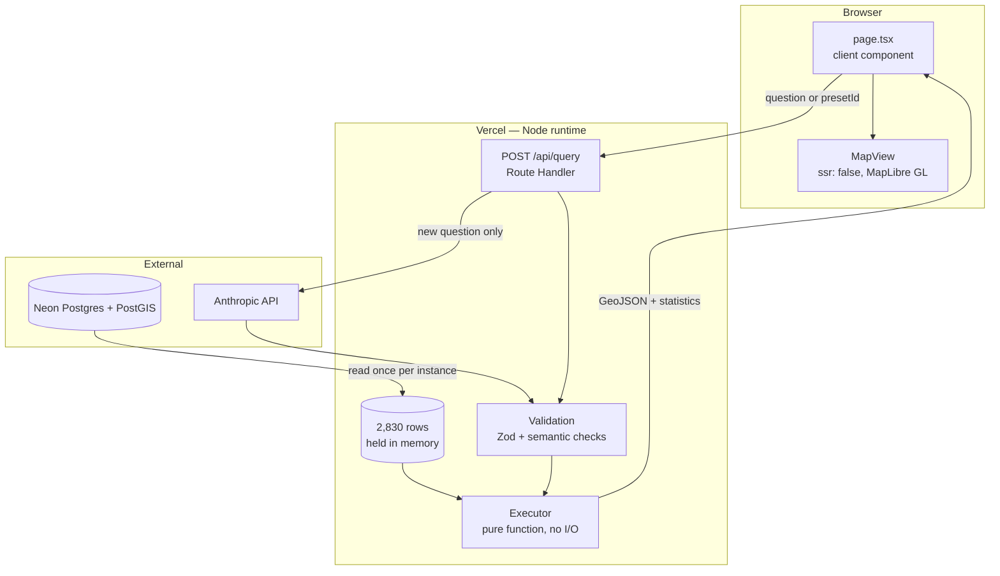

# Catchment

**[Live demo](https://catchment-two.vercel.app)** · [](https://github.com/Changliu53/catchment/actions/workflows/ci.yml)

A full-stack analysis tool for Harris County, Texas. Ask a question in plain
English; the answer is computed over 2,830 census block groups of flood,
income and service-access data and drawn as a choropleth.

> Which flood-exposed neighbourhoods have no supermarket within a kilometre?

Google Maps can tell you where a supermarket is. It cannot express *"more than
half of this area sits in the 100-year floodplain **and** its centre is over a
kilometre from the nearest supermarket"*, and it will not tell you how many
people live there. That gap is the whole project.

Next.js 16 App Router, React 19, TypeScript in strict mode, Postgres with
PostGIS, and a test suite that runs against a production build before anything
deploys.

## Architecture



Everything below the browser box runs on the server. `DATABASE_URL` and
`ANTHROPIC_API_KEY` exist only there; the browser receives a JSON document and
nothing else. The map is a client-only component (`ssr: false`) because
MapLibre needs a canvas and a Web Worker, neither of which exists during
server rendering.

## Decisions worth a look

**The database is not on the request path.** The dataset is 2,830 rows and
changes only when the pipeline is re-run, so it is fetched once per server
instance and memoised. A request never waits on Postgres — which also means a
cold Neon compute costs a visitor nothing. The memoised promise clears itself
if the fetch rejects, so a transient failure is retried rather than cached
forever.

**One endpoint, three tiers, cheapest first.** A preset question resolves from
a plan that shipped with the build: no model call, no API key, no rate-limit
budget. A repeated question resolves from an LRU cache. Only a genuinely new
question reaches the model, and only after the rate limiter agrees. Most
visitors never get past the first tier.

**Errors name their own cause.** A 503 from this API does not say "something
went wrong"; if `DATABASE_URL` is missing it says so, and adds that
environment variables added after a build are not picked up until the next
one — because that is the actual mistake, and it is invisible from the
symptom. The client shows the status and a slice of the body rather than
collapsing everything into "network error", which was a real defect here: a
wrong model ID and a rejected API key both surfaced as the same useless
message, pointing at the network.

**Types hold at the boundary, not just inside it.** Strict TypeScript with
`noUncheckedIndexedAccess`, and every payload crossing into the executor is
re-parsed by a Zod discriminated union first. One field dictionary in
`schema.ts` generates the prompt text *and* the tool schema, so the two cannot
drift — the failure where a prompt still advertises a field renamed six
commits ago is structurally impossible.

**Trade-offs are stated, not hidden.** Rate limiting is an in-memory map, so
on serverless it is per-instance and the real ceiling is looser than the
configured number. That is written down in the module, along with why: the
control that actually bounds the loss is a spend limit on the Anthropic
account, and a Redis dependency would buy precision nothing here needs.

**The UI was measured, not eyeballed.** The map had a height of exactly zero
on a 390px screen — the stacked controls were 1,023px of `shrink-0` content in
an 844px viewport. The legend covered 29.6% of the map on a phone. Tapping a
block group did nothing at all, because every value lived behind `mousemove`.
None of that was visible from a desktop browser, and all of it is now asserted
in Playwright at five widths with touch emulation. The responsive legend
switches layout in CSS rather than by measuring the viewport during render,
which would disagree with the server-rendered HTML.

## The data

| Source | What it provides | Vintage |
| --- | --- | --- |
| Census TIGER/Line | Block-group boundaries | 2024 |
| Census ACS 5-year | Population, median household income | 2024 release |
| FEMA National Flood Hazard Layer | 1% and 0.2% annual-chance flood zones | current NFHL |
| OpenStreetMap | Supermarkets and parks (ODbL) | extract via Overpass |

A Python pipeline (`pipeline/`) joins these, computes the flood overlay and the
nearest-facility distances, and loads the result into Neon Postgres with
PostGIS. Every measurement happens in EPSG:32615 (UTM 15N); EPSG:4326 is used
only for storage and display. Measuring in degrees is how you get answers that
are wrong by a factor that varies with latitude.

### Checked, not assumed

- **The county area comes out right.** The union of all 2,830 block groups is
  4,605.8 km², against an official 4,602 km² — 0.08% off. That single number
  catches a dropped extract, a bad projection, or duplicated geometry at once,
  and `pipeline/county_outline.py` fails rather than shipping an outline if it
  drifts past 1%.
- **Nulls stay null, on the map as well as in the statistics.** Census income
  suppression means "unknown", not "zero", and it covers 273 of the 2,830
  block groups. They are excluded from statistics rather than coerced, they
  sort last in both directions, they are shaded in a neutral grey outside the
  ramp, and the legend counts them. Coercing them would have painted them as
  the poorest neighbourhoods in the county *and* dragged every quantile break
  downwards, so the error would have reached rows whose data was fine.
- **Class breaks are quantiles, not equal intervals.** Population density here
  spans three orders of magnitude; equal intervals would paint 95% of the
  county in the first class and call it a map.
- **Colour contrast is measured on the blend.** Marks sit at 0.85 opacity over
  a basemap, so the ramp was checked against what a reader actually sees, not
  against the raw hex.

## Tests

```bash
npm test            # unit
npm run test:e2e    # end-to-end, against a production build
```

Both run in CI on every push, and a deploy only happens after they pass.

- **Unit** — the executor on hand-built rows, including the null and tie
  cases; the validator rejecting plans that type-check but mean nothing; the
  classifier; and an assertion about how `maplibre-gl` packages its Web Worker.
- **End-to-end** — a real production build with `/api/query` intercepted by a
  fixture, so the suite needs no database and no API key. It asserts the map
  renders the features it was given, that the layout holds from 390px to
  1680px, and — with touch emulation — that tapping a block group opens its
  numbers.
- **A negative control** — one spec removes the Web Worker and asserts the map
  renders *nothing*. A regression test that has never failed is a guess about
  what it measures; this one reproduces the original fault and watches the
  probe go to zero.

That middle layer exists because of a real incident. A MapLibre worker chunk
did not survive bundling, so the map drew nothing while the sources, the
layers, the paint expressions and the console all looked correct — a fault
invisible to every check that did not ask the map itself what it had rendered.
`e2e/map.spec.ts` carries the full story in its header.

## The language-model layer

One component, deliberately small. The model translates English into an
analysis plan and does nothing else: it never sees the data, never computes a
number, and never emits code.

That makes its output safe by construction rather than by sanitising. The tool
schema is a whitelist — eight field names, six operations, a bounded step
count — so there is no string that becomes SQL and no string that becomes
code. A plan naming a field that does not exist fails the Zod union before the
executor runs. Correctness lives in the executor, which is a pure function
over an array of rows and is tested without a model.

Declining is a first-class answer: `decline` is its own tool rather than a
variant the model has to notice it may pick, and the prompt's examples include
a question the dataset genuinely cannot answer. Ask about commute time and it
says so, instead of quietly substituting straight-line distance.

## Running it

```bash
npm install
npm run dev
```

Needs `DATABASE_URL` (Neon, with PostGIS and the dataset loaded) and
`ANTHROPIC_API_KEY`. Without the key the preset questions still work — they
ship with their plans and never call a model.

To rebuild the dataset from scratch: `pipeline/extract.py` → `spatial.py` →
`analyze.py` → `load_postgis.py`, then `county_outline.py`.

## Limits

Distances are straight-line, not travel time — a block group 800m from a
supermarket across a bayou with no bridge is not within 800m of anything. ACS
estimates carry margins of error that this project does not currently surface.
Income is top-coded at $250,001. And the results describe a distribution: they
show where flooding and poor access coincide, not that either causes the other.

## Stack

**Application** — TypeScript (strict, with `noUncheckedIndexedAccess`) ·
Next.js 16 App Router · React 19 · Tailwind CSS v4 · MapLibre GL JS

**Server** — Next.js Route Handlers on the Node runtime · Zod · Neon Postgres
with PostGIS · Anthropic API

**Testing and delivery** — Vitest · Playwright · GitHub Actions gating
deployment to Vercel

**Data pipeline** — Python · GeoPandas · Shapely · PyProj
