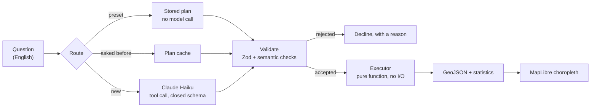

# Catchment

**[Live demo](https://catchment-two.vercel.app)** · [](https://github.com/Changliu53/catchment/actions/workflows/ci.yml)

Ask a question about Harris County, Texas in plain English. A language model
turns it into an analysis plan written in a closed schema; a fixed program runs
that plan over 2,830 census block groups of flood, income and service-access
data; the result is drawn as a choropleth.

> Which flood-exposed neighbourhoods have no supermarket within a kilometre?

Google Maps can tell you where a supermarket is. It cannot express *"more than
half of this area sits in the 100-year floodplain **and** its centre is over a
kilometre from the nearest supermarket"*, and it will not tell you how many
people live there. That gap is the whole project.

## The part worth reading

The model never runs. It never sees the data, never computes a number, and
never emits code — it fills in a schema of six operations, and everything it
produces is re-validated server-side before the executor touches it.



Three things follow from that shape:

**Model output needs no sanitising, because there is nothing to sanitise.** The
tool schema is a whitelist: eight field names, six operations, a bounded step
count. A plan naming a field that does not exist fails a Zod discriminated
union before anything executes. There is no string that becomes SQL and no
string that becomes code.

**Declining is a first-class answer.** `decline` is its own tool, not a variant
the model has to notice it may pick, and the prompt's examples include a
question the dataset genuinely cannot answer. Ask about commute time and it
says so, rather than quietly substituting straight-line distance.

**Correctness lives in the executor**, which is a pure function over an array
of rows — no I/O, no model, no network. It is tested on its own, and the tests
do not need a model to run.

## The data

| Source | What it provides | Vintage |
| --- | --- | --- |
| Census TIGER/Line | Block-group boundaries | 2024 |
| Census ACS 5-year | Population, median household income | 2024 release |
| FEMA National Flood Hazard Layer | 1% and 0.2% annual-chance flood zones | current NFHL |
| OpenStreetMap | Supermarkets and parks (ODbL) | extract via Overpass |

A Python pipeline (`pipeline/`) joins these, computes the flood overlay and the
nearest-facility distances, and loads the result into Neon Postgres with
PostGIS. Every measurement happens in EPSG:32615 (UTM 15N); EPSG:4326 is used
only for storage and display. Measuring in degrees is how you get answers that
are wrong by a factor that varies with latitude.

### Things that are checked, not assumed

- **The county area comes out right.** The union of all 2,830 block groups is
  4,605.8 km², against an official 4,602 km² — 0.08% off. That single number
  catches a dropped extract, a bad projection, or duplicated geometry at once,
  and `pipeline/county_outline.py` fails rather than shipping an outline if it
  drifts past 1%.
- **Nulls stay null.** Census income suppression means "unknown", not "zero".
  Rows with no value are excluded from statistics rather than coerced, and they
  sort last in both directions.
- **Class breaks are quantiles, not equal intervals.** Population density here
  spans three orders of magnitude; equal intervals would paint 95% of the
  county in the first class and call it a map.
- **Colour contrast is measured on the blend.** Marks sit at 0.85 opacity over
  a basemap, so the ramp was checked against what a reader actually sees, not
  against the raw hex.

## Running it

```bash
npm install
npm run dev
```

Needs `DATABASE_URL` (Neon, with PostGIS and the dataset loaded) and
`ANTHROPIC_API_KEY`. Without the key the preset questions still work — they
ship with their plans and never call a model.

To rebuild the dataset from scratch, see `pipeline/`: `extract.py` →
`spatial.py` → `analyze.py` → `load_postgis.py`, then `county_outline.py`.

## Tests

```bash
npm test            # unit — executor, validation, classification, packaging
npm run test:e2e    # end-to-end — Playwright against a production build
```

Both run in CI on every push. Three layers, each guarding something different:

- **Unit** — the executor's behaviour on hand-built rows, including the null
  and tie cases; the validator's rejection of plans that type-check but mean
  nothing; and an assertion about how `maplibre-gl` packages its Web Worker.
- **End-to-end** — a real production build, with `/api/query` intercepted by a
  fixture so the suite needs no database and no API key. It asserts the map
  actually renders features and that the layout survives from 390px to 1680px.
- **A negative control** — one spec removes the Web Worker and asserts the
  map renders nothing. A regression test that has never failed is a guess about
  what it measures; this one reproduces the original fault and watches the
  probe go to zero.

That middle layer exists because of a real incident: a worker chunk that did
not survive bundling made the map draw nothing while every other check passed.
`e2e/map.spec.ts` carries the full story in its header.

## Limits

Distances are straight-line, not travel time — a block group 800m from a
supermarket across a bayou with no bridge is not within 800m of anything. ACS
estimates carry margins of error that this project does not currently surface.
Income is top-coded at $250,001. And the results describe a distribution: they
show where flooding and poor access coincide, not that either causes the other.

## Stack

Next.js 16 (App Router) · React 19 · TypeScript (strict) · Tailwind CSS v4 ·
MapLibre GL · Zod · Vitest · Playwright · Neon Postgres + PostGIS · Anthropic
API · Vercel · GeoPandas / Shapely / PyProj
